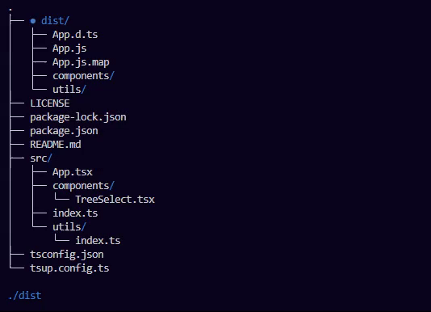

# ink-tree-select [](https://www.npmjs.com/package/ink-tree-select) [](https://npmjs.org/package/ink-tree-select) [](https://npmjs.org/package/ink-tree-select)

Tree select component built for [ink](https://www.npmjs.com/package/ink)

Please consider following this project's author, [Sina Bayandorian](https://github.com/sina-byn), and consider starring the project to show your :heart: and support.



## Installation

```shell
npm i ink-tree-select
```

## Usage

```js
// * index.tsx

import { render, Text } from 'ink';
import React, { useState } from 'react';
import { TreeSelect } from 'ink-tree-select';

const App = () => {
  const [selectedPath, setSelectedPath] = useState<string>('');
  const selectHandler = (path: string) => setSelectedPath(path);

  return (
    <>
      <TreeSelect root='./' onSelect={selectHandler} />
      {selectedPath.length > 0 && <Text>{selectedPath}</Text>}
    </>
  );
};

render(<App />);
```

## Props

|          |                    Type                     | Default |              Description               |
|----------|---------------------------------------------|---------|----------------------------------------|
|   root   |                   string                    |         |         Root directory to scan         |
| onChange |       `(activePath: string) => void;`       |         | Triggers on every selected path change |
| onSelect |      `(selectedPath: string) => void;`      |         |    Triggers once user hits `Enter`     |
| options  |            `TreeSelectOptions`              |  `{ }`  |                                        |

## TreeSelectOptions

```ts
type TreeSelectOptions = Partial<{
  // * directories to ignore - read https://www.npmjs.com/package/fast-glob#ignore
  ignore: string[];
  rootAlias: string; // default to '.' - tree's root
  previewColor: Color; // path preview text color
  indicatorColor: Color; // ● color
}>;
```